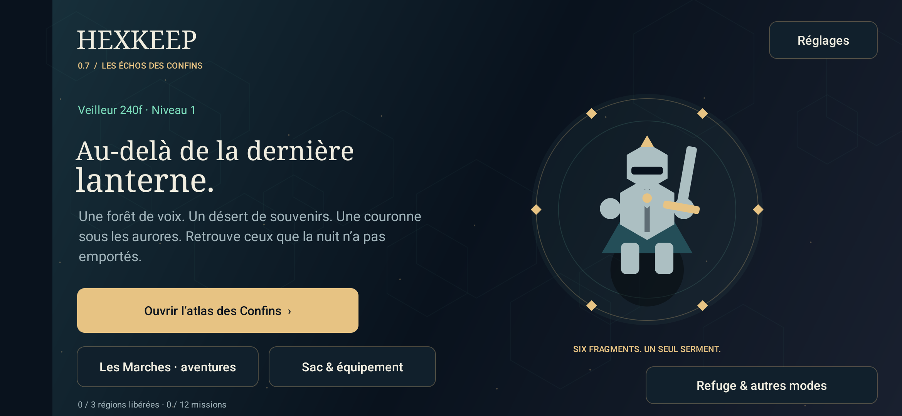
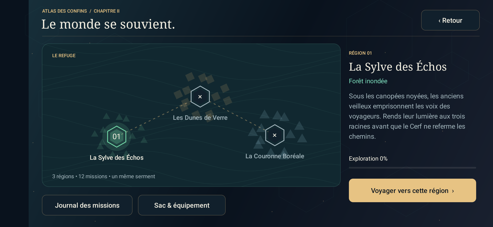
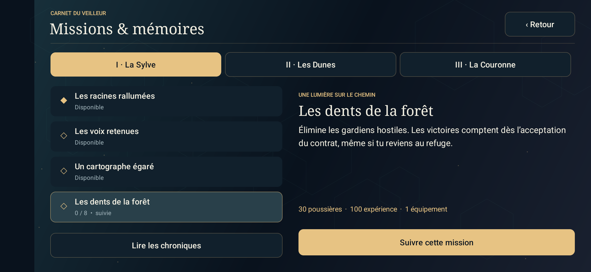
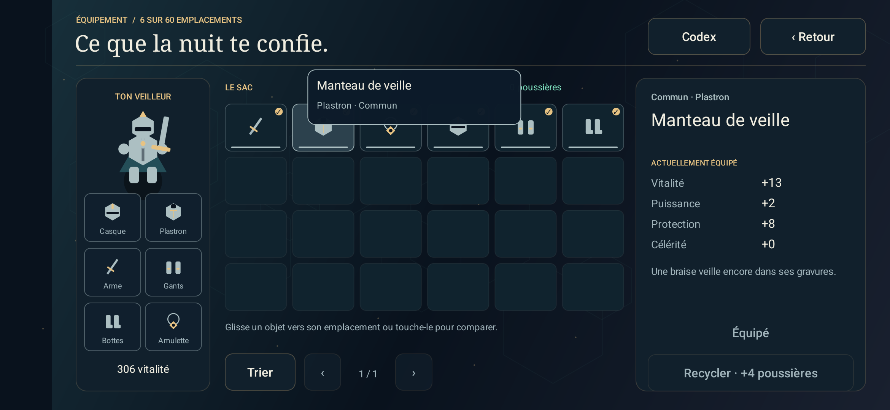
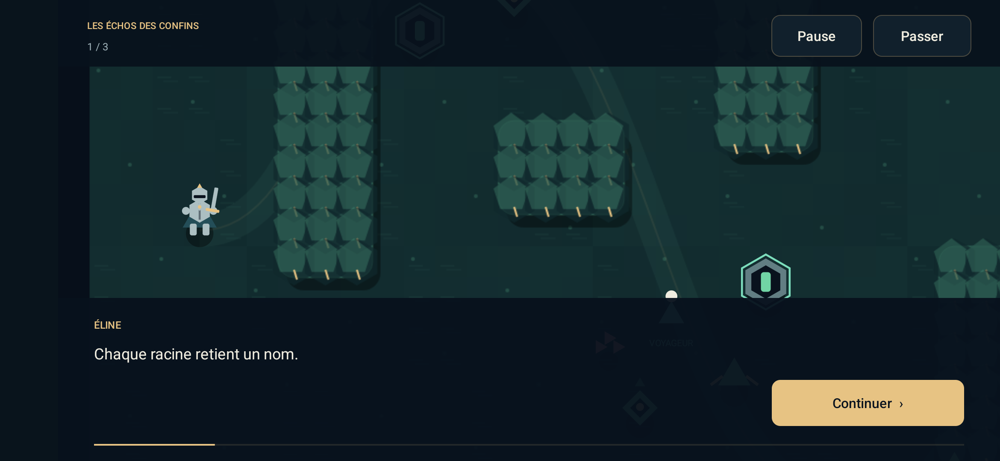
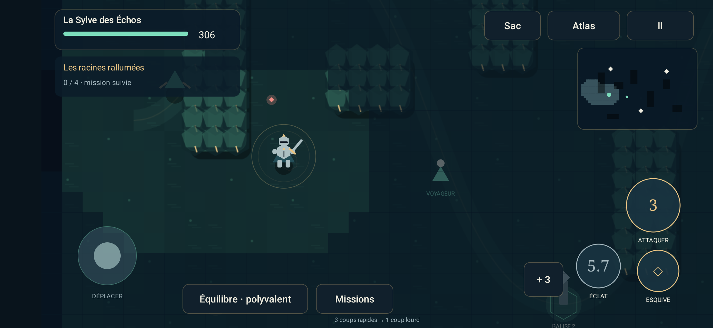

<div align="center">

# HEXKEEP
### Les Échos des Confins · v0.7

*Là où personne ne veille, le monde s’éteint.*



**Un action-RPG de lanternes, de ruines et de mémoires. Une édition solo hors ligne préparée pour les tests Google Play.**

[](docs/installation.md)
[](CHANGELOG.md)
[](https://github.com/nabz0r/HexKeep/actions/workflows/ci.yml)

**[⬇ Prévisualisation Play · solo](downloads/HEXKEEP-v0.7-PLAY-preview.apk)** · **[⬇ Mise à jour DEV](downloads/HEXKEEP-v0.7-DEV.apk)** · [Dossier Google Play](docs/play-release.md) · [Livraison 0.7](docs/delivery-v07.md)

</div>

---

## Ce que livre la 0.7

**Les Échos des Confins** ouvre une campagne de trois grandes régions : la Sylve des Échos, les Dunes de Verre et la Couronne Boréale. Un atlas relie ces biomes, douze missions guident leur découverte et des cinématiques racontent le voyage d’Éline. Les nouveaux décors, personnages et équipements utilisent des formes procédurales originales.

Le combat de campagne apporte trois postures, trois frappes rapides suivies d’une finissante, des esquives, un éclat de lumière, des impacts suspendus et cinq nouveaux comportements ennemis. Les trois gardiens évoluent en trois phases. Le sac devient une grille avec glisser-déposer, comparaison, tri et six emplacements visibles sur le veilleur. Les cinq aventures précédentes restent accessibles depuis **Les Marches** ; **Refuge & autres modes** conserve les autres fonctions.

[Changelog](CHANGELOG.md) · [Architecture 0.7](docs/architecture-v07.md) · [Guide de campagne](docs/player-guide-v07.md) · [Direction et références](docs/design-v07.md)

| Édition | Usage | Identifiant |
|---|---|---|
| **Play · prévisualisation** | Campagne des Confins, cinq aventures solo, objets et mémoires. Sans Internet, GPS, publicité, achats intégrés ou compte. APK signée pour test ; signature différente de la future distribution officielle possible | `game.hexkeep` |
| **DEV · mise à jour** | Même aventure, plus les outils géolocalisés, pairs, forteresses et expériences de royaume de la 0.5 | `game.hexkeep.dev` |
| **Production réseau** | Verrouillée en attente d’une autorité officielle ; ce n’est pas le lancement solo | Variante `prod`, non distribuée aux joueurs |

**Le jeu n’est pas encore publié sur Google Play.** L’AAB est construit et contrôlé ; la clé d’envoi officielle, la configuration du compte, les déclarations, les tests sur téléphones et l’éventuel test fermé restent nécessaires. Le [dossier de publication](docs/play-release.md) indique chaque étape et ses conditions. L’interface est française. La progression est locale : les deux éditions ne partagent pas leurs données et une désinstallation efface la sauvegarde.



## Une lumière. Trois serments. Des chemins à retrouver.

Les routes ont disparu sous la brume. Au refuge, Éline conserve une carte dont les noms s’effacent. Chaque veilleur porte une lanterne : ses pas révèlent les marches, ses victoires réveillent les pierres, ses compagnons rendent les forteresses habitables.

**Aurelon** porte l’aube. **Skarn** endure le givre. **Vylde** écoute la sève. Choisis ton royaume et ton rôle — **Foudre**, **Rempart** ou **Lien** — puis pars chercher ce que la nuit a laissé derrière elle.

## Les aventures en jeu

| Sentir chaque geste | Explorer et comprendre | Préparer le prochain départ |
|:--|:--|:--|
| **84 poses peintes** : marche, dos, frappe et esquive | **Cinq contrats**, dont une veillée et une chasse aux curiosités | **Sac et statistiques accessibles en combat** |
| Direction du corps, trajectoires, impacts et chute des ennemis | **Sept familles d’ennemis**, invocations, élites et gardien en furie | **72 modèles d’objets**, quatre raretés et quatre serments |
| Joystick analogique, visée assistée ou manuelle, glissement aux murs | Cinq coffres, source de soin, autel et chat à découvrir | Deux pièces du même serment donnent un bonus |
| Aventure solo suspendue pendant la consultation du sac | Consigne permanente, boussole, mini-carte et annonces de danger | **Neuf mémoires**, bestiaire et trois difficultés à débloquer |

<table>
<tr><td></td><td></td></tr>
<tr><td></td><td></td></tr>
</table>

### Jouer en cinq gestes

1. Installe la [prévisualisation Play](downloads/HEXKEEP-v0.7-PLAY-preview.apk) ou mets à jour la [DEV](downloads/HEXKEEP-v0.7-DEV.apk), sans désinstaller l’ancienne version.
2. Découvre les gestes dans le prologue, puis ouvre **l’atlas des Confins** au refuge.
3. Accepte les missions secondaires dans le journal. Voyage vers la Sylve, recueille ses mémoires et secours son voyageur.
4. Maintiens **Attaquer** pour enchaîner trois frappes rapides et une lourde. Change de posture, esquive les annonces rouges et utilise tes fioles. Rallume les trois balises pour appeler le gardien.
5. Ouvre le sac pour comparer et glisser les objets vers les six emplacements. Réclame tes missions dans le journal, rentre à l’atlas et découvre la région suivante.

**Mise à jour :** la signature et l’identifiant `game.hexkeep.dev` restent ceux des versions DEV précédentes. Installer par-dessus conserve les données. Ne désinstalle pas pour mettre à jour. Les mots de récupération restent dans **Réglages → Mon Nom & sauvegarde**. Le [guide d’installation](docs/installation.md) explique les cas particuliers.

## Un projet de MMO, un périmètre testable

La direction est celle d’un monde partagé à trois royaumes. Cette version livre un **réseau de développement entre pairs, jusqu’à dix participants**, avec découverte locale, connexion directe, relais, sièges, chroniques et preuves de combat. Les bonus d’équipement restent propres aux expéditions ; les combats réseau appliquent le même Codex à tous.

Les cinq contrats et leur butin sont **des activités PvE locales**. La DEV ne prétend pas fournir un serveur MMO public permanent ni des milliers de joueurs simultanés. Les jalons **M0 à M7** sont présents dans la DEV, avec leurs limites de qualification détaillées dans le [manuel GM](docs/gm-manual.md) et le [rapport de livraison](docs/delivery-v05.md). La production reste verrouillée tant que sa chaîne officielle de confiance n’est pas configurée.

## Construire et tester

Prérequis : Rust stable, JDK 17, SDK Android 36, NDK `28.2.13676358`, `cargo-ndk`. Le projet contient les sources, les ressources artistiques, le verrou des dépendances, le wrapper Gradle et les tests. Les clés privées et les installations locales des outils sont exclues.

```sh
rustup target add aarch64-linux-android armv7-linux-androideabi x86_64-linux-android
cargo install cargo-ndk --locked
scripts/build.sh
adb install -r artifacts/HEXKEEP-v0.7-DEV.apk
```

`JAVA_HOME`, `ANDROID_HOME` et `ANDROID_NDK_HOME` peuvent désigner tes installations. Le script construit la DEV debug, la DEV release signée, la production réseau verrouillée, la prévisualisation Play et son AAB. La signature officielle Play est configurable par variables d’environnement ; voir le dossier de publication. **La production unsigned n’est pas l’APK à installer.** Une compilation locale utilise ta propre clé debug ; elle peut donc demander une autre installation que le paquet distribué. La clé de distribution DEV n’est pas publiée.

```sh
cargo test --workspace --locked --release
cargo run --release -p hk-core --example adventure -- --all-tiers --offline
cargo run --release -p hexkeep-sim -- determinism
cargo run --release -p hexkeep-sim -- replay examples/cosigned-duel.json
```

Le parcours `adventure` joue les 45 combinaisons royaume × rôle × contrat avec les véritables commandes, les collisions, les caches et la sauvegarde. L’option `--all-tiers` couvre **135 parcours** sur les trois difficultés, avec l’équipement du butin et l’esquive des zones marquées. Les tests Android injectent des gestes tactiles et vérifient notamment multitouch, pause, inventaire, changement de format et migration de l’APK. Voir [comment reproduire les essais](docs/test-protocols.md).

### Réseau entre pairs

Dans **Jouer avec des veilleurs**, lance la recherche sur chaque téléphone, dans la même marche et sur le même Wi-Fi. **Connexion directe / relais** accepte une multiadresse libp2p. Utilise la même version sur tous les appareils : les corrections de navigation de la 0.5 conservent le protocole 0.5 dans la 0.6. La campagne 0.7 est isolée du combat réseau : le protocole historique reste inchangé. Utilise la même version de l’application pour les essais entre pairs.

```sh
cargo build --release -p hexkeep-sim -p hexkeep-relay -p crown
target/release/hexkeep-relay 4001
target/release/hexkeep-sim peer --id 0 --seconds 200 --autostart 9
target/release/hexkeep-sim peer --id 1 --seconds 200 --connect MULTIADRESSE
python3 scripts/network-smoke.py relay 2 180
python3 scripts/android-ten.py
```

Le test mixte requiert deux émulateurs de test aux ports 5554 et 5556, installés avec l’application et son APK d’instrumentation. Il ajoute huit pairs natifs et compare leurs états calculés indépendamment. [Architecture et limites du réseau](docs/protocol.md).

## Dans le dépôt

```text
android/        Application Kotlin, rendu, commandes tactiles, audio et services
crates/         Simulation, monde H3, progression, réseau, identité et Couronne
tools/         Simulateur, relais, cérémonie et outillage UniFFI
scripts/        Construction et bancs de test
examples/       Preuve de combat publique rejouable
docs/           Manuel, histoire, décisions, captures et rapports
downloads/      APK signée de la version livrée et empreinte SHA-256
```

## Lire le passé, dessiner les chemins

HEXKEEP reprend des **principes** : la lisibilité des objectifs et de la progression de WoW, les rôles et les intentions de combat de LoL, les trois royaumes et les forteresses de DAoC, la réactivité du déplacement de Quake III. Les personnages, textes, illustrations, musique et implémentations sont propres au projet. [Références](docs/design-v04.md) · [Direction de la 0.6](docs/design-v06.md).

| Jouer et comprendre | Développer et vérifier |
|:--|:--|
| [Guide du joueur](docs/player-guide.md) | [Architecture](docs/architecture.md) |
| [Histoire et bible](docs/bible.md) | [Décisions techniques](docs/adr/) |
| [Manuel des jalons M0–M7](docs/gm-manual.md) | [Protocoles de test](docs/test-protocols.md) |
| [Économie](docs/economy.md) | [Rapport v0.6](docs/delivery-v06.md) |
| [Vie privée Play](docs/privacy-play.md) · [DEV](docs/privacy.md) | [Menaces et confiance](docs/threat-model.md) |
| [Animations et création artistique](docs/art/v05-atlases.md) | [Historique des versions](CHANGELOG.md) |

---

Licence **AGPL-3.0**, conformément au dépôt d’accueil. Les notices des composants et des ressources figurent dans [THIRD_PARTY_NOTICES.md](THIRD_PARTY_NOTICES.md). Les validations sur émulateurs ne remplacent pas une campagne sur téléphones physiques ; leurs résultats et leurs limites sont consignés dans le rapport.
