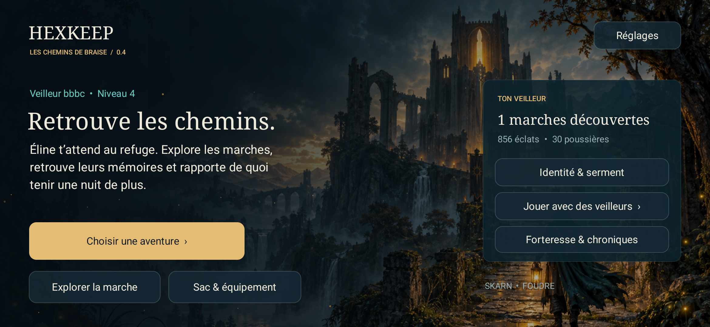
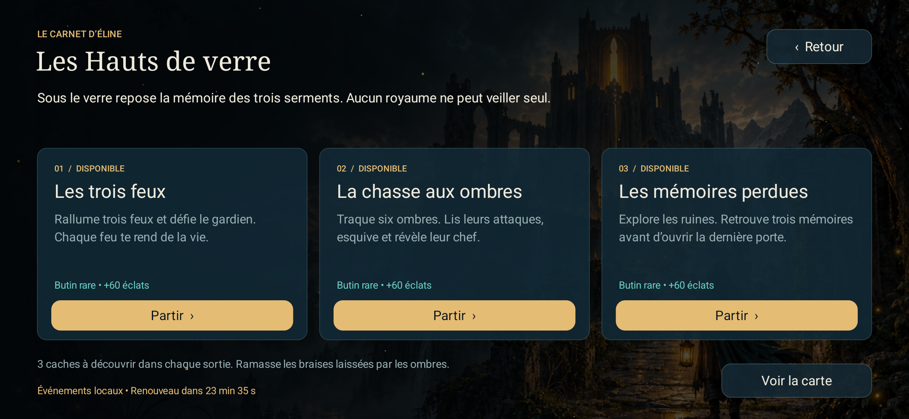
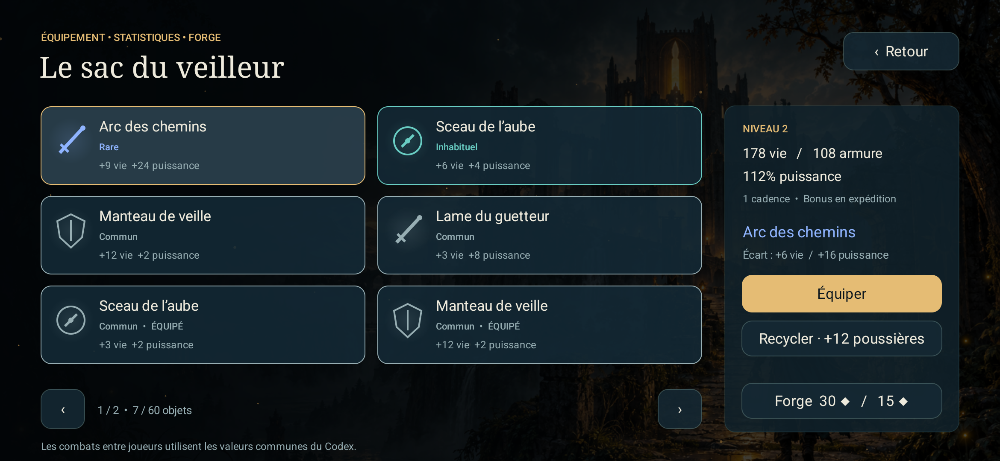
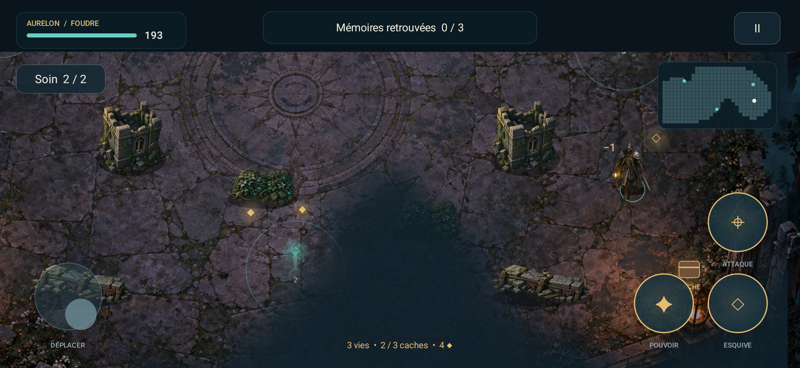

<div align="center">

# HEXKEEP
### Les Chemins de Braise · v0.4

*Là où personne ne veille, le monde s’éteint.*


**Un action-RPG Android géolocalisé, avec des royaumes, des forteresses et un monde à tenir allumé.**

[](docs/installation.md)
[](CHANGELOG.md)
[](docs/architecture.md)
[](LICENSE)

**[⬇ Télécharger l’APK signée](https://github.com/nabz0r/HexKeep/raw/refs/heads/main/downloads/HEXKEEP-v0.4.apk)** · [Commencer à jouer](docs/player-guide.md) · [Notes de version](CHANGELOG.md) · [Validation](docs/delivery-v04.md)

</div>

---

## Une lumière. Trois serments. Des chemins à retrouver.

Les routes ont disparu sous la brume. Au refuge, Éline conserve une carte dont les noms s’effacent. Chaque veilleur porte une lanterne : ses pas révèlent les marches, ses victoires réveillent les pierres, ses compagnons rendent les forteresses habitables.

**Aurelon** porte l’aube. **Skarn** endure le givre. **Vylde** écoute la sève. Choisis ton royaume et ton rôle — **Foudre**, **Rempart** ou **Lien** — puis pars chercher ce que la nuit a laissé derrière elle.

## La 0.4 en jeu

| Prendre en main | Partir à l’aventure | Construire son veilleur |
|:--|:--|:--|
| Joystick analogique progressif et recentrage du pouce | Trois contrats : feux, chasse, mémoires | Sac de 60 objets, trois emplacements |
| Esquive, pouvoir, visée manuelle ou assistée | Caméra rapprochée, brume révélée, mini-carte | Quatre raretés, comparaison des bonus |
| Glissement contre les murs, chemins calculés pour les ennemis | Trois caches, butin au sol, deux fioles de soin | Équipement, recyclage et forge |
| Attaques ennemies annoncées et obstacles lisibles | Marches H3, GPS facultatif et exploration simulée | Sauvegarde chiffrée, niveau et journal |

<table>
<tr><td></td><td></td></tr>
<tr><td></td><td></td></tr>
</table>

### Jouer en cinq gestes

1. Installe **[HEXKEEP-v0.4.apk](downloads/HEXKEEP-v0.4.apk)**. Le paquet principal est signé et contient ARM64, ARMv7 et x86_64. Android 8 minimum.
2. Entre dans la nuit, choisis ton veilleur et découvre les commandes dans le prologue jouable.
3. Au refuge, ouvre **Choisir une aventure**. À gauche, déplace-toi ; à droite, vise ; les deux grands boutons déclenchent esquive et pouvoir. Maintenir ATTAQUE vise un ennemi visible ; glisser depuis ce bouton permet de viser soi-même.
4. Explore les caches, ramasse les braises, termine le contrat et reviens au refuge pour conserver le butin. Ouvre **Sac & équipement** pour comparer, équiper ou recycler.
5. **Explorer la marche** permet d’activer le GPS ou de voyager en simulation. **Jouer avec des veilleurs** ouvre la recherche locale et les combats entre joueurs.

**Mise à jour :** la signature et l’identifiant `game.hexkeep.dev` restent ceux des versions DEV précédentes. Installer par-dessus conserve les données. Ne désinstalle pas pour mettre à jour. Les mots de récupération restent dans **Réglages → Mon Nom & sauvegarde**. Le [guide d’installation](docs/installation.md) explique les cas particuliers.

## Un projet de MMO, un périmètre testable

La direction est celle d’un monde partagé à trois royaumes. Cette version livre un **réseau de développement entre pairs, jusqu’à dix participants**, avec découverte locale, connexion directe, relais, sièges, chroniques et preuves de combat. Les bonus d’équipement restent propres aux expéditions ; les combats réseau appliquent le même Codex à tous.

Les trois contrats et leur butin sont **des activités PvE locales**. La 0.4 ne prétend pas fournir un serveur MMO public permanent ni des milliers de joueurs simultanés. Les jalons **M0 à M7** sont présents dans la DEV, avec leurs limites de qualification détaillées dans le [manuel GM](docs/gm-manual.md) et le [rapport de livraison](docs/delivery-v04.md). La production reste verrouillée tant que sa chaîne officielle de confiance n’est pas configurée.

## Construire et tester

Prérequis : Rust stable, JDK 17, SDK Android 36, NDK `28.2.13676358`, `cargo-ndk`. Le projet contient les sources, les ressources artistiques, le verrou des dépendances, le wrapper Gradle et les tests. Les clés privées et les installations locales des outils sont exclues.

```sh
rustup target add aarch64-linux-android armv7-linux-androideabi x86_64-linux-android
cargo install cargo-ndk --locked
scripts/build.sh
adb install -r artifacts/HEXKEEP-v0.4.apk
```

`JAVA_HOME`, `ANDROID_HOME` et `ANDROID_NDK_HOME` peuvent désigner tes installations. Le script construit la DEV debug, la DEV release signée et la production unsigned. **La production unsigned n’est pas l’APK à installer.** Une compilation locale utilise ta propre clé debug ; elle peut donc demander une autre installation que le paquet distribué. La clé de distribution DEV n’est pas publiée.

```sh
cargo test --workspace --locked --release
cargo run --release -p hk-core --example adventure
cargo run --release -p hexkeep-sim -- determinism
cargo run --release -p hexkeep-sim -- replay examples/cosigned-duel.json
```

Le parcours `adventure` joue les 27 combinaisons royaume × rôle × contrat avec les véritables commandes, les collisions, les caches et la sauvegarde. Les tests Android injectent des gestes tactiles et vérifient notamment multitouch, pause, inventaire, changement de format et migration de l’APK. Voir [comment reproduire les essais](docs/test-protocols.md).

### Réseau entre pairs

Dans **Jouer avec des veilleurs**, lance la recherche sur chaque téléphone, dans la même marche et sur le même Wi-Fi. **Connexion directe / relais** accepte une multiadresse libp2p. Utilise la même version sur tous les appareils : le protocole 0.4 est séparé de celui de la 0.3.

```sh
cargo build --release -p hexkeep-sim -p hexkeep-relay -p crown
target/release/hexkeep-relay 4001
target/release/hexkeep-sim peer --id 0 --seconds 200 --autostart 9
target/release/hexkeep-sim peer --id 1 --seconds 200 --connect MULTIADRESSE
python3 scripts/network-smoke.py relay 2 180
python3 scripts/android-ten.py
```

Le test mixte requiert deux émulateurs de test aux ports 5554 et 5556, installés avec l’application et son APK d’instrumentation. Il ajoute huit pairs natifs et compare leurs états calculés indépendamment. [Architecture et limites du réseau](docs/protocol.md).

## Dans le dépôt

```text
android/        Application Kotlin, rendu, commandes tactiles, audio et services
crates/         Simulation, monde H3, progression, réseau, identité et Couronne
tools/         Simulateur, relais, cérémonie et outillage UniFFI
scripts/        Construction et bancs de test
examples/       Preuve de combat publique rejouable
docs/           Manuel, histoire, décisions, captures et rapports
downloads/      APK signée de la version livrée et empreinte SHA-256
```

## Lire le passé, dessiner les chemins

HEXKEEP reprend des **principes** : la lisibilité des objectifs et de la progression de WoW, les rôles et les intentions de combat de LoL, les trois royaumes et les forteresses de DAoC, la réactivité du déplacement de Quake III. Les personnages, textes, illustrations, musique et implémentations sont propres au projet. [Références et choix de conception](docs/design-v04.md).

| Jouer et comprendre | Développer et vérifier |
|:--|:--|
| [Guide du joueur](docs/player-guide.md) | [Architecture](docs/architecture.md) |
| [Histoire et bible](docs/bible.md) | [Décisions techniques](docs/adr/) |
| [Manuel des jalons M0–M7](docs/gm-manual.md) | [Protocoles de test](docs/test-protocols.md) |
| [Économie](docs/economy.md) | [Rapport v0.4](docs/delivery-v04.md) |
| [Vie privée](docs/privacy.md) | [Menaces et confiance](docs/threat-model.md) |
| [Direction artistique](docs/art/v03-direction.md) | [Historique des versions](CHANGELOG.md) |

---

Licence **AGPL-3.0**, conformément au dépôt d’accueil. Les notices des composants et des ressources figurent dans [THIRD_PARTY_NOTICES.md](THIRD_PARTY_NOTICES.md). Les validations sur émulateurs ne remplacent pas une campagne sur téléphones physiques ; leurs résultats et leurs limites sont consignés dans le rapport.
