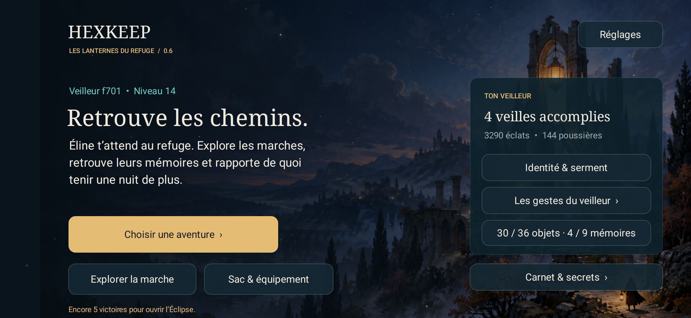
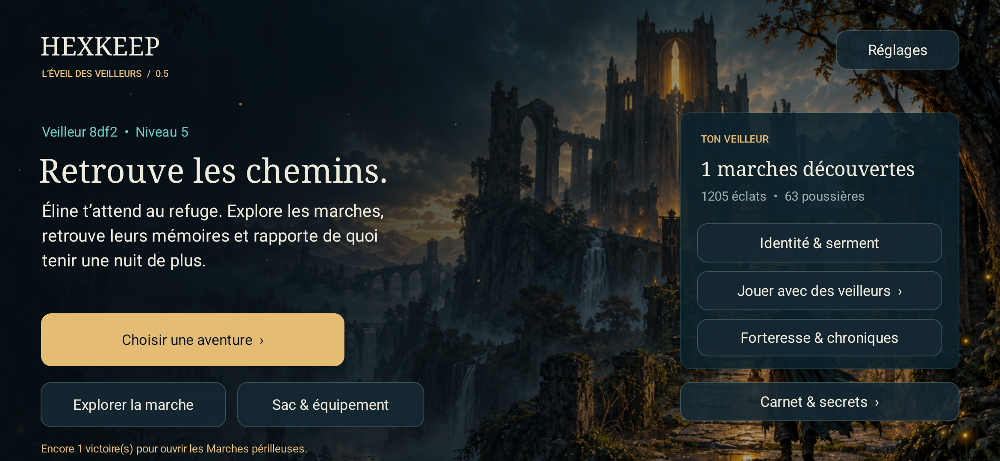
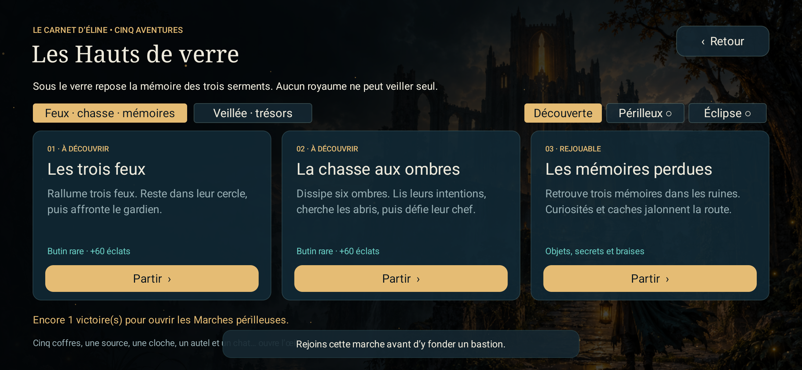
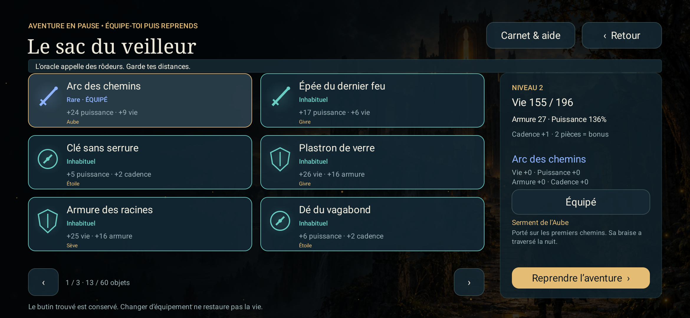
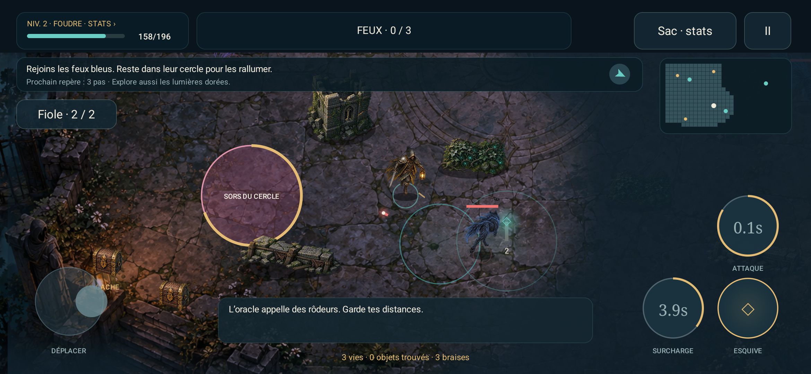

<div align="center">

# HEXKEEP
### Les Lanternes du Refuge · v0.6

*Là où personne ne veille, le monde s’éteint.*


**Un action-RPG de lanternes, de ruines et de mémoires. Une édition solo hors ligne préparée pour les tests Google Play.**

[](docs/installation.md)
[](CHANGELOG.md)
[](https://github.com/nabz0r/HexKeep/actions/workflows/ci.yml)

**[⬇ Prévisualisation Play · solo](downloads/HEXKEEP-v0.6-PLAY-preview.apk)** · **[⬇ Mise à jour DEV](downloads/HEXKEEP-v0.6-DEV.apk)** · [Dossier Google Play](docs/play-release.md) · [Validation 0.6](docs/delivery-v06.md)

</div>

---

## Ce que livre la 0.6

Le refuge reçoit une nouvelle peinture originale et un visuel de couverture. L’aventure reprend après fermeture : position, ennemis, objectifs, caches, fioles et butin sont conservés, avec une reprise volontaire en pause. L’aide, les réglages de confort, la politique de confidentialité et les licences sont accessibles dans le jeu. Les encoches et le retour système Android récent sont pris en compte.

| Édition | Usage | Identifiant |
|---|---|---|
| **Play · prévisualisation** | Cinq aventures solo, exploration fictive, objets et mémoires. Sans Internet, GPS, publicité, achats intégrés ou compte. APK signée pour test ; signature différente de la future distribution officielle possible | `game.hexkeep` |
| **DEV · mise à jour** | Même aventure, plus les outils géolocalisés, pairs, forteresses et expériences de royaume de la 0.5 | `game.hexkeep.dev` |
| **Production réseau** | Verrouillée en attente d’une autorité officielle ; ce n’est pas le lancement solo | Variante `prod`, non distribuée aux joueurs |

**Le jeu n’est pas encore publié sur Google Play.** L’AAB est construit et contrôlé ; la clé d’envoi officielle, la configuration du compte, les déclarations, les tests sur téléphones et l’éventuel test fermé restent nécessaires. Le [dossier de publication](docs/play-release.md) indique chaque étape et ses conditions. L’interface est française. La progression est locale : les deux éditions ne partagent pas leurs données et une désinstallation efface la sauvegarde.



## Une lumière. Trois serments. Des chemins à retrouver.

Les routes ont disparu sous la brume. Au refuge, Éline conserve une carte dont les noms s’effacent. Chaque veilleur porte une lanterne : ses pas révèlent les marches, ses victoires réveillent les pierres, ses compagnons rendent les forteresses habitables.

**Aurelon** porte l’aube. **Skarn** endure le givre. **Vylde** écoute la sève. Choisis ton royaume et ton rôle — **Foudre**, **Rempart** ou **Lien** — puis pars chercher ce que la nuit a laissé derrière elle.

## Les aventures en jeu

| Sentir chaque geste | Explorer et comprendre | Préparer le prochain départ |
|:--|:--|:--|
| **84 poses peintes** : marche, dos, frappe et esquive | **Cinq contrats**, dont une veillée et une chasse aux curiosités | **Sac et statistiques accessibles en combat** |
| Direction du corps, trajectoires, impacts et chute des ennemis | **Sept familles d’ennemis**, invocations, élites et gardien en furie | **36 modèles d’objets**, quatre raretés et quatre serments |
| Joystick analogique, visée assistée ou manuelle, glissement aux murs | Cinq coffres, source de soin, autel et chat à découvrir | Deux pièces du même serment donnent un bonus |
| Aventure solo suspendue pendant la consultation du sac | Consigne permanente, boussole, mini-carte et annonces de danger | **Neuf mémoires**, bestiaire et trois difficultés à débloquer |

<table>
<tr><td></td><td></td></tr>
<tr><td></td><td></td></tr>
</table>

### Jouer en cinq gestes (édition DEV)

1. Installe **[HEXKEEP-v0.6-DEV.apk](downloads/HEXKEEP-v0.6-DEV.apk)**. Le paquet principal est signé et contient ARM64, ARMv7 et x86_64. Android 8 minimum.
2. Entre dans la nuit, choisis ton veilleur et découvre les commandes dans le prologue jouable.
3. Au refuge, ouvre **Choisir une aventure**. À gauche, déplace-toi ; à droite, vise ; les deux grands boutons déclenchent esquive et pouvoir. Maintenir ATTAQUE vise un ennemi visible ; glisser depuis ce bouton permet de viser soi-même.
4. Approche des curiosités et touche **Interagir**. Le butin arrive immédiatement dans le sac. En combat, touche **Sac · stats** ou ta barre de vie pour comparer et équiper, puis reprendre la même aventure. La forge et le recyclage t’attendent au refuge.
5. **Explorer la marche** permet d’activer le GPS ou de voyager en simulation. **Jouer avec des veilleurs** ouvre la recherche locale et les combats entre joueurs.

**Mise à jour :** la signature et l’identifiant `game.hexkeep.dev` restent ceux des versions DEV précédentes. Installer par-dessus conserve les données. Ne désinstalle pas pour mettre à jour. Les mots de récupération restent dans **Réglages → Mon Nom & sauvegarde**. Le [guide d’installation](docs/installation.md) explique les cas particuliers.

## Un projet de MMO, un périmètre testable

La direction est celle d’un monde partagé à trois royaumes. Cette version livre un **réseau de développement entre pairs, jusqu’à dix participants**, avec découverte locale, connexion directe, relais, sièges, chroniques et preuves de combat. Les bonus d’équipement restent propres aux expéditions ; les combats réseau appliquent le même Codex à tous.

Les cinq contrats et leur butin sont **des activités PvE locales**. La DEV ne prétend pas fournir un serveur MMO public permanent ni des milliers de joueurs simultanés. Les jalons **M0 à M7** sont présents dans la DEV, avec leurs limites de qualification détaillées dans le [manuel GM](docs/gm-manual.md) et le [rapport de livraison](docs/delivery-v05.md). La production reste verrouillée tant que sa chaîne officielle de confiance n’est pas configurée.

## Construire et tester

Prérequis : Rust stable, JDK 17, SDK Android 36, NDK `28.2.13676358`, `cargo-ndk`. Le projet contient les sources, les ressources artistiques, le verrou des dépendances, le wrapper Gradle et les tests. Les clés privées et les installations locales des outils sont exclues.

```sh
rustup target add aarch64-linux-android armv7-linux-androideabi x86_64-linux-android
cargo install cargo-ndk --locked
scripts/build.sh
adb install -r artifacts/HEXKEEP-v0.6-DEV.apk
```

`JAVA_HOME`, `ANDROID_HOME` et `ANDROID_NDK_HOME` peuvent désigner tes installations. Le script construit la DEV debug, la DEV release signée, la production réseau verrouillée, la prévisualisation Play et son AAB. La signature officielle Play est configurable par variables d’environnement ; voir le dossier de publication. **La production unsigned n’est pas l’APK à installer.** Une compilation locale utilise ta propre clé debug ; elle peut donc demander une autre installation que le paquet distribué. La clé de distribution DEV n’est pas publiée.

```sh
cargo test --workspace --locked --release
cargo run --release -p hk-core --example adventure -- --all-tiers --offline
cargo run --release -p hexkeep-sim -- determinism
cargo run --release -p hexkeep-sim -- replay examples/cosigned-duel.json
```

Le parcours `adventure` joue les 45 combinaisons royaume × rôle × contrat avec les véritables commandes, les collisions, les caches et la sauvegarde. L’option `--all-tiers` couvre **135 parcours** sur les trois difficultés, avec l’équipement du butin et l’esquive des zones marquées. Les tests Android injectent des gestes tactiles et vérifient notamment multitouch, pause, inventaire, changement de format et migration de l’APK. Voir [comment reproduire les essais](docs/test-protocols.md).

### Réseau entre pairs

Dans **Jouer avec des veilleurs**, lance la recherche sur chaque téléphone, dans la même marche et sur le même Wi-Fi. **Connexion directe / relais** accepte une multiadresse libp2p. Utilise la même version sur tous les appareils : les corrections de navigation de la 0.5 conservent le protocole 0.5 dans la 0.6. Les versions DEV 0.5 et 0.6 utilisent les mêmes règles de combat réseau.

```sh
cargo build --release -p hexkeep-sim -p hexkeep-relay -p crown
target/release/hexkeep-relay 4001
target/release/hexkeep-sim peer --id 0 --seconds 200 --autostart 9
target/release/hexkeep-sim peer --id 1 --seconds 200 --connect MULTIADRESSE
python3 scripts/network-smoke.py relay 2 180
python3 scripts/android-ten.py
```

Le test mixte requiert deux émulateurs de test aux ports 5554 et 5556, installés avec l’application et son APK d’instrumentation. Il ajoute huit pairs natifs et compare leurs états calculés indépendamment. [Architecture et limites du réseau](docs/protocol.md).

## Dans le dépôt

```text
android/        Application Kotlin, rendu, commandes tactiles, audio et services
crates/         Simulation, monde H3, progression, réseau, identité et Couronne
tools/         Simulateur, relais, cérémonie et outillage UniFFI
scripts/        Construction et bancs de test
examples/       Preuve de combat publique rejouable
docs/           Manuel, histoire, décisions, captures et rapports
downloads/      APK signée de la version livrée et empreinte SHA-256
```

## Lire le passé, dessiner les chemins

HEXKEEP reprend des **principes** : la lisibilité des objectifs et de la progression de WoW, les rôles et les intentions de combat de LoL, les trois royaumes et les forteresses de DAoC, la réactivité du déplacement de Quake III. Les personnages, textes, illustrations, musique et implémentations sont propres au projet. [Références](docs/design-v04.md) · [Direction de la 0.6](docs/design-v06.md).

| Jouer et comprendre | Développer et vérifier |
|:--|:--|
| [Guide du joueur](docs/player-guide.md) | [Architecture](docs/architecture.md) |
| [Histoire et bible](docs/bible.md) | [Décisions techniques](docs/adr/) |
| [Manuel des jalons M0–M7](docs/gm-manual.md) | [Protocoles de test](docs/test-protocols.md) |
| [Économie](docs/economy.md) | [Rapport v0.6](docs/delivery-v06.md) |
| [Vie privée Play](docs/privacy-play.md) · [DEV](docs/privacy.md) | [Menaces et confiance](docs/threat-model.md) |
| [Animations et création artistique](docs/art/v05-atlases.md) | [Historique des versions](CHANGELOG.md) |

---

Licence **AGPL-3.0**, conformément au dépôt d’accueil. Les notices des composants et des ressources figurent dans [THIRD_PARTY_NOTICES.md](THIRD_PARTY_NOTICES.md). Les validations sur émulateurs ne remplacent pas une campagne sur téléphones physiques ; leurs résultats et leurs limites sont consignés dans le rapport.
